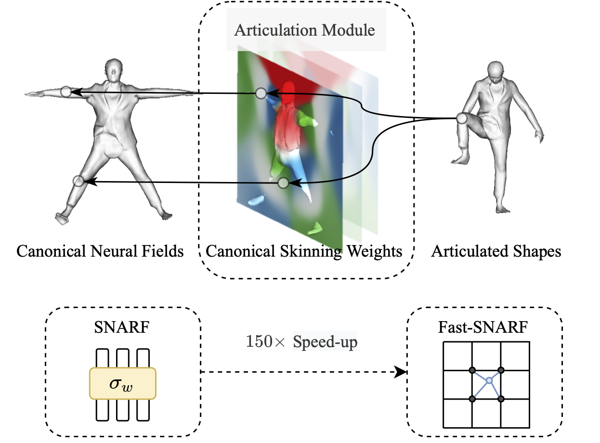
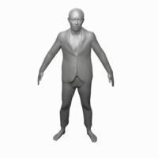

# Fast-SNARF: A Fast Deformer for Articulated Neural Fields
## [Paper](https://dataset.ait.ethz.ch/downloads/fast-snarf/paper.pdf) 

  

Fast-SNARF models the articulation of neural fields. It allows learning articulated objects from deformed observations, such as 3D posed meshes, in an accurate and fast way. In particular, Fast-SNARF achieves similar accuracy as its parent [SNARF](https://github.com/xuchen-ethz/SNARF) while being 150x faster. 

In this repo, we apply Fast-SNARF to learn animatable avatars from 3D data. More application (e.g. learning from images) will be announced later.

# Quick Start
Clone this repo:
```
git clone https://github.com/xuchen-ethz/fast-snarf.git
cd fast-snarf
```

Install environment:
```
conda env create -f environment.yml
conda activate fast_snarf
python setup.py install
```


Download [SMPL models](https://smpl.is.tue.mpg.de/downloads) (1.0.0 for Python 2.7 (10 shape PCs)) and move them to the corresponding places:
```
mkdir lib/smpl/smpl_model/
mv /path/to/smpl/models/basicModel_f_lbs_10_207_0_v1.0.0.pkl lib/smpl/smpl_model/SMPL_FEMALE.pkl
mv /path/to/smpl/models/basicmodel_m_lbs_10_207_0_v1.0.0.pkl lib/smpl/smpl_model/SMPL_MALE.pkl
```

Download our pretrained models and test motion sequences: 
```
sh ./download_data.sh
```

Run a quick demo for clothed human:
```
python demo.py expname=cape subject=3375 demo.motion_path=data/aist_demo/seqs +experiments=cape
```
You can the find the video in `outputs/cape/3375/demo.mp4` and images in `outputs/cape/3375/images/`. To save the meshes, add `demo.save_mesh=true` to the command.

You can also try other subjects (see `outputs/data/cape` for available options) by setting `subject=xx`, and other motion sequences from [AMASS](https://amass.is.tue.mpg.de/download.php) by setting `demo.motion_path=/path/to/amass_modetion.npz`.

Some motion sequences have high fps and one might want to skip some frames. To do this, add `demo.every_n_frames=x` to consider every x frame in the motion sequence. (e.g. `demo.every_n_frames=10` for PosePrior sequences) 

# Training and Evaluation

## Minimally Clothed Human
### Prepare Datasets
Download the [AMASS](https://amass.is.tue.mpg.de/download.php) dataset. We use ''DFaust Snythetic'' and ''PosePrior'' subsets and SMPL-H format. Unzip the dataset into `data` folder.
```
tar -xf DFaust67.tar.bz2 -C data
tar -xf MPILimits.tar.bz2 -C data
```

Preprocess dataset:
```
python preprocess/sample_points.py --output_folder data/DFaust_processed
python preprocess/sample_points.py --output_folder data/MPI_processed --skip 10 --poseprior
```


### Training
Run the following command to train for a specified subject:
```
python train.py subject=50002
```

Training logs are available on [wandb](https://wandb.ai/home) (registration needed, free of charge). It should take ~25 minutes on a single 2080Ti.

### Evaluation
Run the following command to evaluate the method for a specified subject on within distribution data (DFaust test split):
```
python test.py subject=50002
```
and outside destribution (PosePrior):
```
python test.py subject=50002 datamodule=jointlim
```

### Generate Animation
You can use the trained model to generate animation (same as in Quick Start):
```
python demo.py expname='dfaust' subject=50002 demo.motion_path='data/aist_demo/seqs'
```


## Clothed Human

### Training
Download the [CAPE](https://cape.is.tue.mpg.de/) dataset and unzip into `data` folder.

Run the following command to train for a specified subject and clothing type:
```
python train.py datamodule=cape subject=3375 datamodule.clothing='blazerlong' +experiments=cape  
```
Training logs are available on [wandb](https://wandb.ai/home). It should take 1 hour on a single 2080Ti.

### Generate Animation
You can use the trained model to generate animation (same as in Quick Start):
```
python demo.py expname=cape subject=3375 demo.motion_path=data/aist_demo/seqs +experiments=cape
```

# Reference
If you find our code or paper useful, please cite as
```
@article{chen2022fastsnarf,
  title={Fast-SNARF: A Fast Deformer for Articulated Neural Fields},
  author={Chen, Xu and Jiang, Tianjian and Song, Jie and Rietmann, Max and Geiger, Andreas and Black, Michael J and Hilliges Otmar},
  journal={arXiv},
  year={2022}
}

@inproceedings{chen2021snarf,
  title={SNARF: Differentiable Forward Skinning for Animating Non-Rigid Neural Implicit Shapes},
  author={Chen, Xu and Zheng, Yufeng and Black, Michael J and Hilliges, Otmar and Geiger, Andreas},
  booktitle={International Conference on Computer Vision (ICCV)},
  year={2021}
}
```
<!-- # Additional Use Cases Enabled by Fast-SNARF
 

Fast-SNARF can be combined with instant-NGP and NeRF to learn avatars from monocular videos within minutes.  -->

# Acknowledgement
We use the pre-processing code in [PTF](https://github.com/taconite/PTF) and [LEAP](https://github.com/neuralbodies/leap) with some adaptions (`./preprocess`). The network and sampling part of the code (`lib/model/network.py` and `lib/model/sample.py`) is implemented based on [IGR](https://github.com/amosgropp/IGR) and [IDR](https://github.com/lioryariv/idr). The code for extracting mesh (`lib/utils/meshing.py`) is adapted from [NASA](https://github.com/tensorflow/graphics/tree/master/tensorflow_graphics/projects/nasa). Our implementation of Broyden's method (`lib/model/broyden.py`) is based on [DEQ](https://github.com/locuslab/deq). We sincerely thank these authors for their awesome work.
